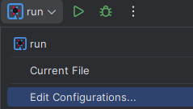
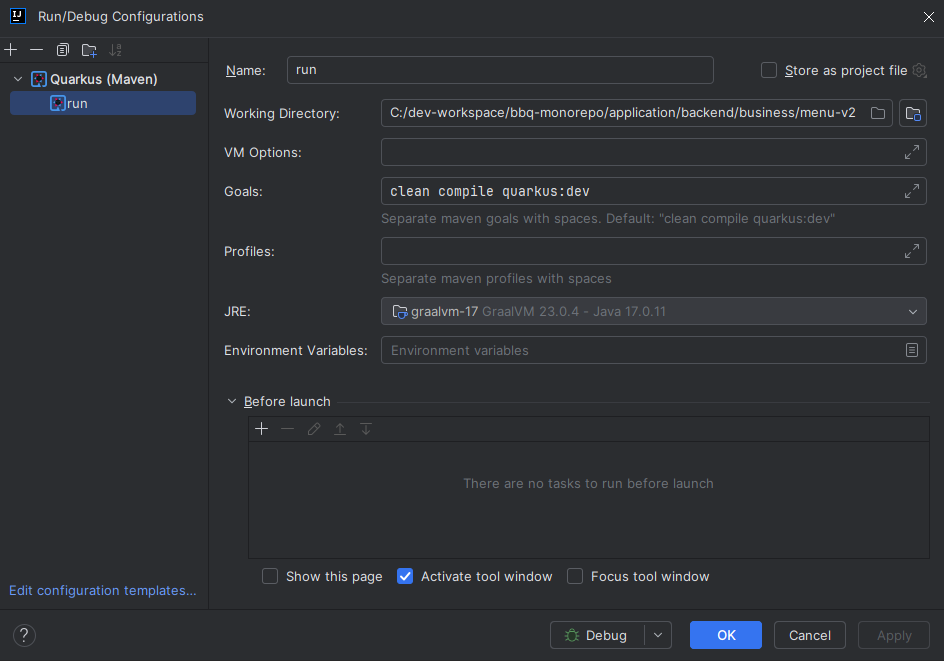

# EJECUTAR APLICACIÓN QUARKUS

[← Ir a Quarkus](./../README.md) <br>

## IntelliJ IDEA
- Instale el plugin `Quarkus Run Configs`


- Seleccione `Edit configuration`



- Agregue una nueva configuración para Quarkus con Maven


- Configure el proyecto
```
clean compile quarkus:dev
```

