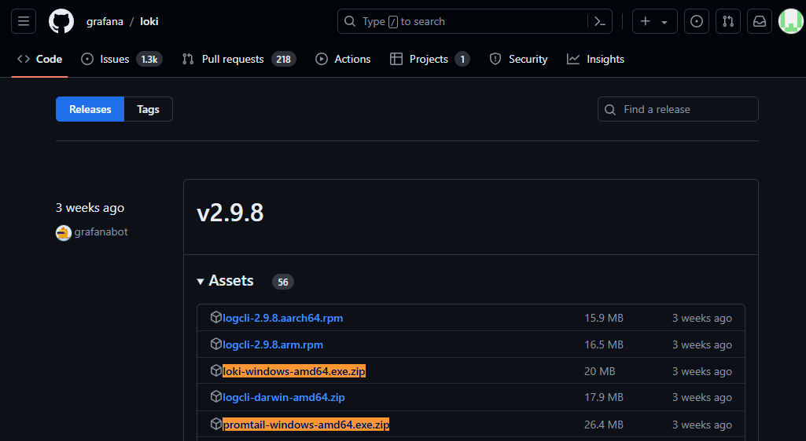

# INSTALACIÓN LOKI

- [Descargar](https://github.com/grafana/loki/releases/) `loki-windows-amd64.exe.zip` y `promtail-windows-amd64.exe.zip` desde la release de su preferencia.



- Descargar el archivo de configuración para cada uno de los ejecutables. Para ello, reemplace la versión en los siguientes enlaces.
  - loki: https://raw.githubusercontent.com/grafana/loki/v2.9.8/cmd/loki/loki-local-config.yaml
  - promtail: https://raw.githubusercontent.com/grafana/loki/v2.9.8/clients/cmd/promtail/promtail-local-config.yaml


- **Rutas sugeridas**:
```javascript
  loki
  ├───loki
  │   ├───loki-windows-amd64.exe
  │   └───loki-local-config.yaml
  └───prompail
      ├───promtail-windows-amd64.exe
      └───promtail-local-config.yaml
```

> - Ejecutar Loki: `.\loki-windows-amd64.exe --config.file=loki-local-config.yaml`
> - Ejecutar Promptail: `.\promtail-windows-amd64.exe --config.file=promtail-local-config.yaml`

[Instrucciones oficiales](https://grafana.com/docs/loki/latest/setup/install/local/)