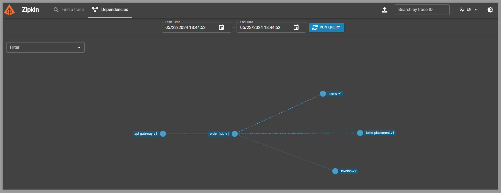

# ZIPKIN

[← Ir a Monitoreo](./../README.md)

# Trazabilidad
Podemos rastrear la trazabilidad de nuestras peticiones desde el tab `Find a trace`.

Con el botón `SHOW` podemos ver el detalle.

# Dependencias
Podemos ver el flujo de nuestras peticiones accediendo al tab `Dependencies`.

