# CONFIGURAR API EN EL APIM

- [1. Crear variables](#1-crear-variables)
- [2. Crear producto](#2-crear-producto)
- [3. Configurar políticas](#3-configurar-politicas)
- [4. Generar suscripción por producto](#4-generar-suscripcion-por-producto)
- [5. Validar creacion de la API](#4-validar-creacion-de-la-api)

Ingresar al recurso del API Management.
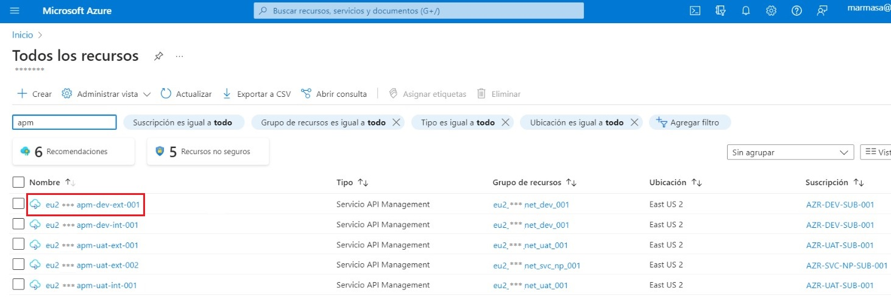

## 1. Crear variables
1. Ubicarse en el menú izquierdo, sección `APIs`.
   1. Seleccionar `Valores con nombres`.
   2. Hacer clic en el botón `+ Agregar`.
   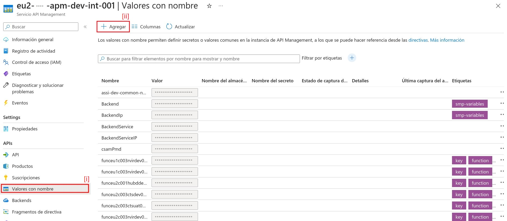

2. Completar los campos obligatorios en el formulario.
   1. `Nombre`: Nombre de la aplicación en formato PascalCase. Ej. `LockAccessLogger`.
   2. `Nombre para mostrar`: Mismo valor que el campo `Nombre`.
   3. `Etiquetas`: Dar clic en el botón ➕ e ingresar el código del canal. Ej. `app`.
   4. `Tipo`: Seleccionar secreto.
   5. `Valor`: Ingrese el base URI de la API. Ej. `lock-access-logger/api/v1`.
   6. Dar clic en el botón `Guardar`
   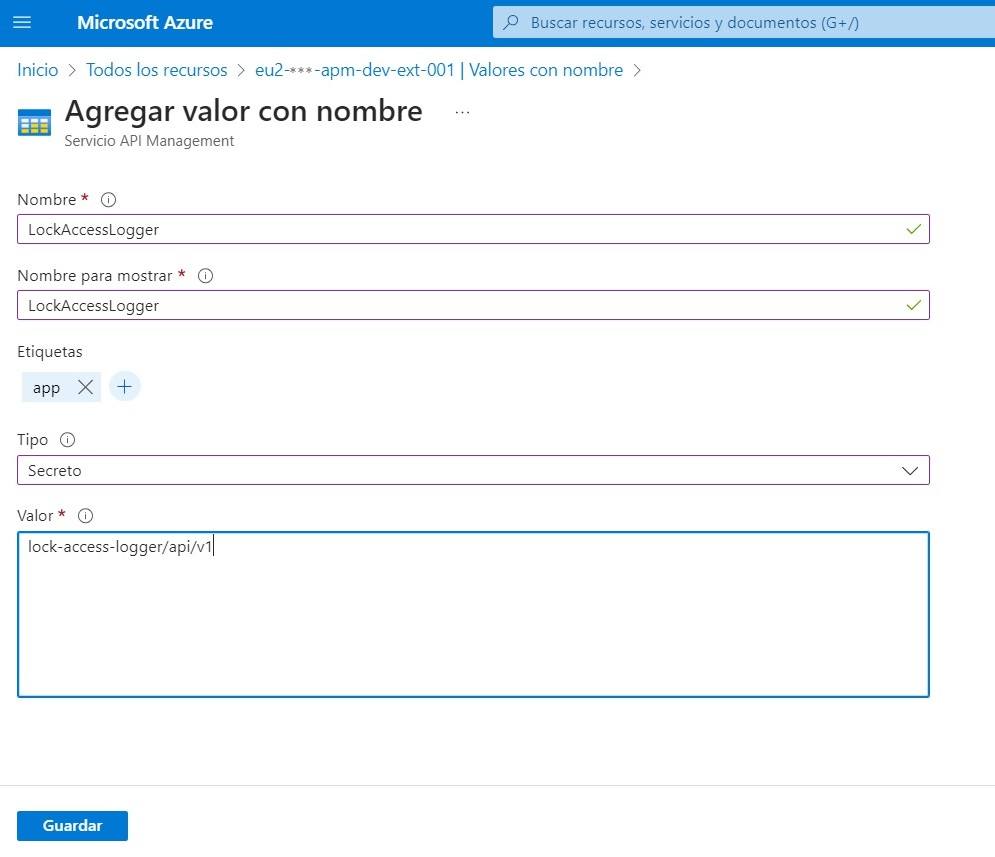

## 2. Crear producto
1. Ubicarse en el menú izquierdo, sección `APIs`.
   1. Seleccionar `Productos`.
   2. Hacer clic en el botón `+ Agregar`.
   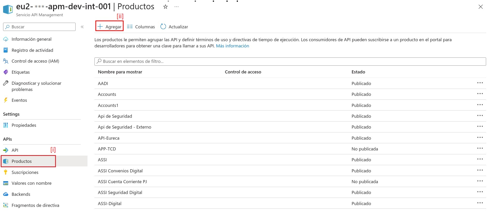

2. Completar los campos obligatorios en el formulario.
   1. `Id`: Nombre de la aplicación en formato kebab-case. Ej. `lock-access-logger`.
   2. `Nombre para mostrar`: Mismo valor que el campo `Id`.
   3. `Descripción`: Ingrese una descripción adecuada para la API.
   4. `Publicado`: Habilitado.
   5. `Requiere suscripción`: Habilitado.
   6. Dar clic en el botón `Crear`
   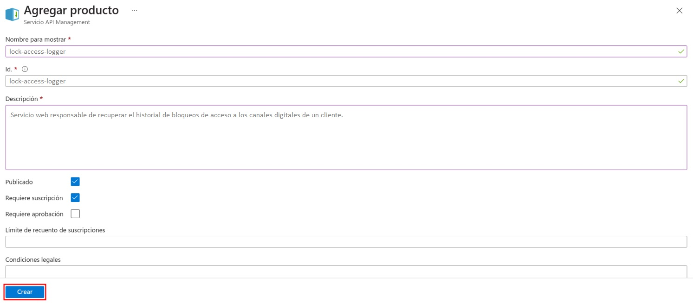

## 3. Configurar politicas
1. Ubicarse en el menú izquierdo, sección `APIs`.
   1. Seleccionar `Productos`.
   2. Buscar el producto creado en el `paso 2` y seleccionarlo.
   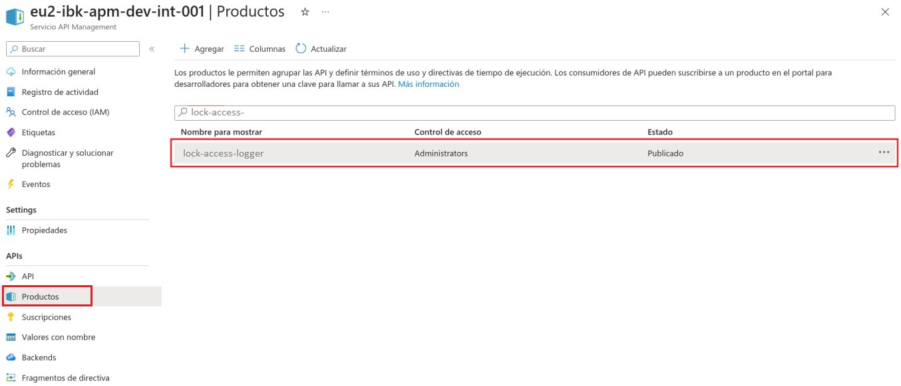

2. Ubicarse en el nuevo menú izquierdo y seleccionar `Directivas`.
   1. Dar clic en el botón `</>` ubicado en el panel `Backend`.
   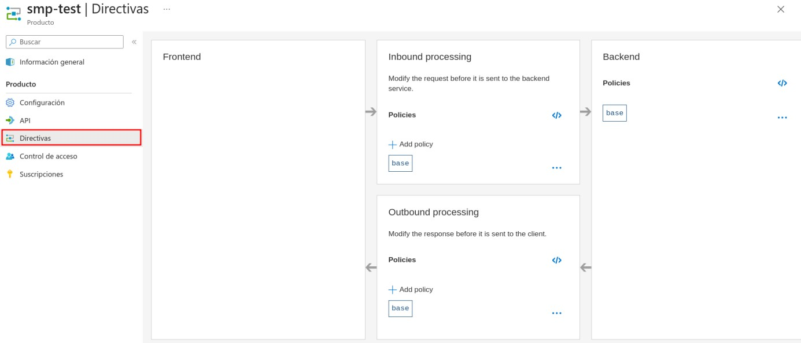
   2. Abrir el archivo `apim-policy.xml` ubicado en el directorio `./resources/` y copiar su contenido en el editor de directivas.
   3. Dar clic en el botón `Save`.
   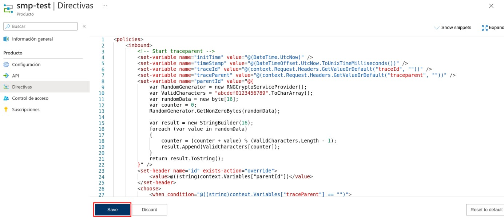

## 4. Generar suscripcion por producto
1. Ubicarse en el menú izquierdo, sección `APIs`.
   1. Seleccionar `Productos`.
   2. Buscar el producto creado en el `paso 2` y seleccionarlo.
   

2. Ubicarse en el nuevo menú izquierdo y seleccionar `Suscripciones`.
   1. Dar clic en el botón de tres puntos `···`.
   2. Seleccionar la opción `Mostrar u ocultar claves`.
   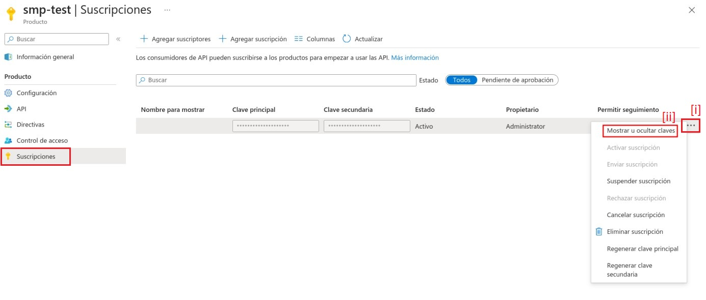
   3. Dar clic en el botón de copiar en el portapapeles 📄 de la Clave principal.
   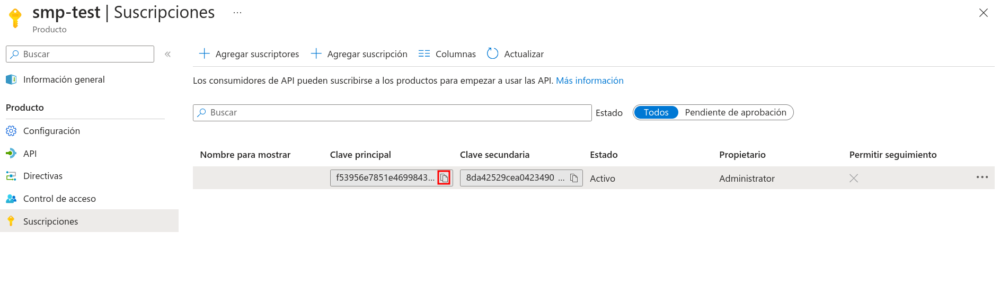

## 4. Crear API
1. Ubicarse en el menú izquierdo, sección `APIs`.
   1. Seleccionar `API`.
   2. Dar clic en el botón `+ Add API`.
   3. Seleccionar la opción `OpenAPI` de la sección `Create from definition`.
   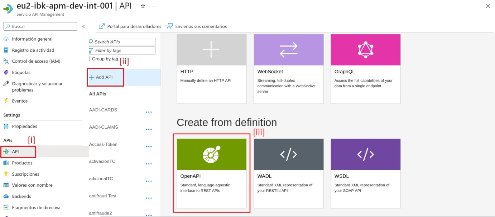

2. Completar los campos obligatorios en el formulario.
   1. Seleccionar la opción `Full`.
   2. Dar clic en el botón `Select a file` para importar la especificación OpenAPI `openapi.json`.
   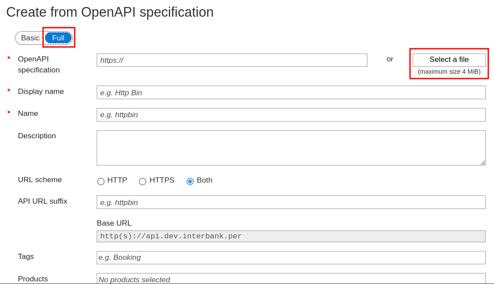
   Algunos campos serán cargados desde el archivo importado y configuraremos los demás.
   3. `Tags`: Ingrese el código del canal, presione el botón `Create item <channel-code>` y selecciónelo.
   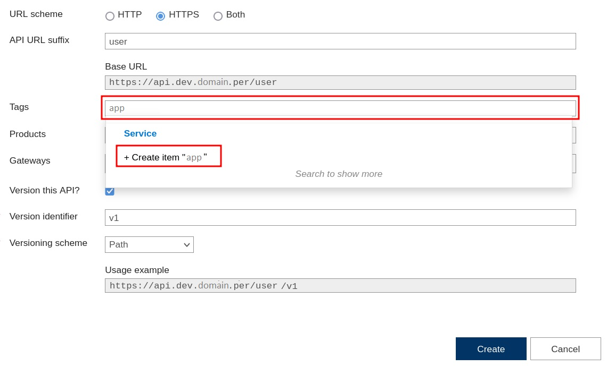
   4. `API URL suffix`: Nombre de la aplicación en formato kebab-case más el sufijo `/api`. Ej. `lock-access-logger/api`
   5. `Products`: Producto creado en el `paso 2`.
   6. `Version this API?`: Habilitado
   7. `Version identifier`: Versión de la API. Ej. `v1`
   8. Dar clic en el botón `Create`
   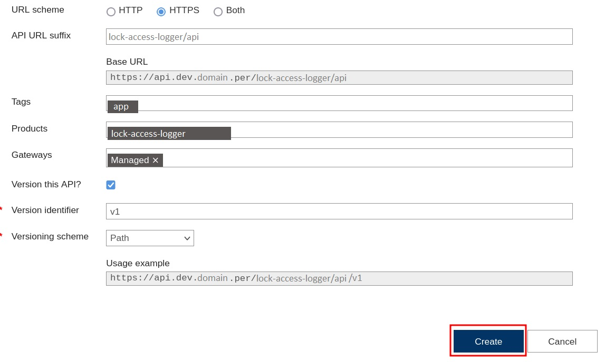
   9. Ingresar a la pestaña `Settings` y validar que el campo `Header name` corresponda con la especificación del contrato.
   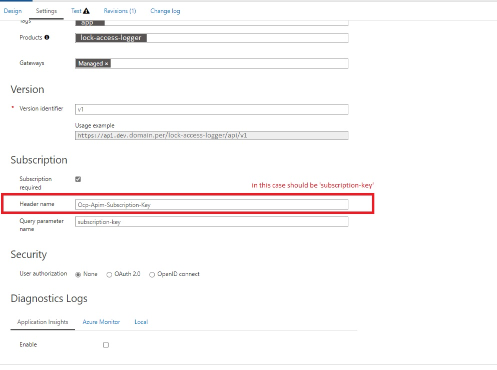
   10. Dar clic en `Save`.

## 5. Validar creacion de la API
1. Ubicarse en el menú izquierdo, sección `APIs`.
   1. Seleccionar `API`.
   2. Buscar la API creada en el `paso 4`.
   3. Seleccionar la versión y mostrar las operaciones.
   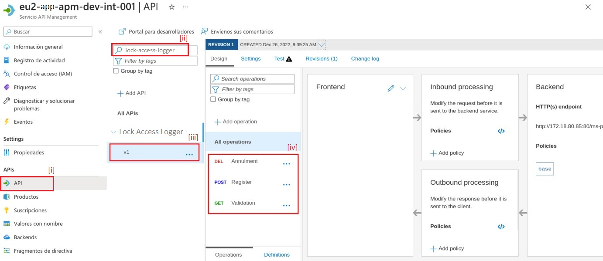
   4. Testear las operaciones.
   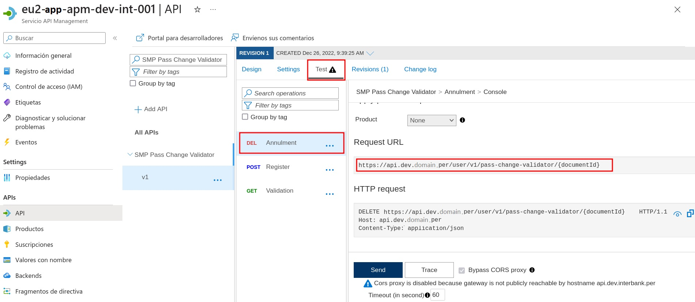
