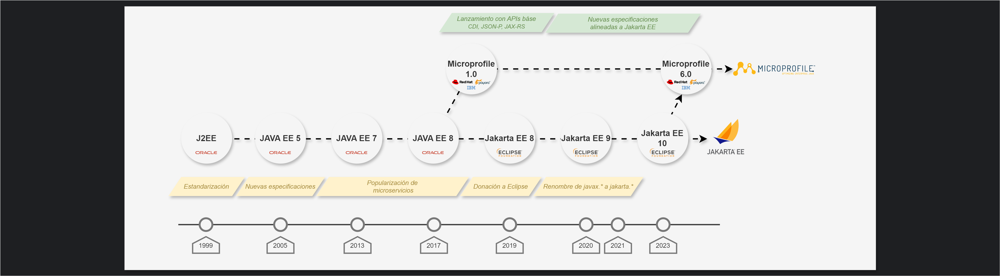
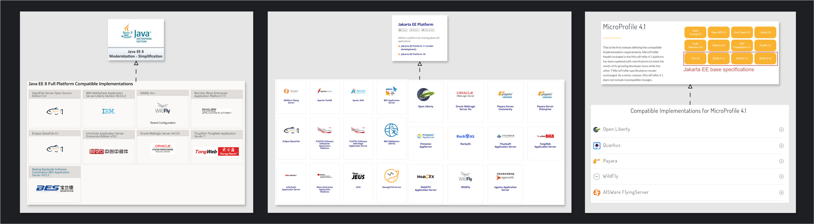

## JAVA COMMUNITY PROCESS (JCP)

[← Regresar Jakarta EE & Microprofile](./../README.md)  

> **Especificaciones**:  
> Una especificación define un conjunto de reglas e interfaces que las implementaciones deben seguir para asegurar la compatibilidad y portabilidad.

La JCP es un proceso formalizado en el que la comunidad de desarrollo y organizaciones interesadas colaboran para 
estandarizar Java en la creación de aplicaciones empresariales, promoviendo la portabilidad y compatibilidad entre 
diferentes implementaciones.

Antes del JCP cada fabricante construía sus productos con su propio estilo de programación. Fueron las especificaciones
del `J2EE` (Java 2 Platform, Enterprise Edition), introducidas a finales de los 90, las que dieron inicio a un esfuerzo
formal de estandarización que luego evolucionó hacia `Java EE` y lo que hoy conocemos como `Jakarta EE`.

| Fecha | Evento                                       | Descripción                                                                                                                                              |   
|-------|----------------------------------------------|----------------------------------------------------------------------------------------------------------------------------------------------------------|
| 1999  | Lanzamiento de J2EE                          | Sun Microsystems lanza J2EE para estandarizar el desarrollo de aplicaciones empresariales en Java.                                                       |
| 2006  | Renombramiento a Java EE 5                   | J2EE se renombra a Java EE 5, introduciendo nuevas características como `EJB` 3.0 y `JPA`.                                                               |
| 2009  | Java EE 6                                    | Introducción de `CDI` y mejoras en `EJB` y `JPA` para simplificar el desarrollo.                                                                         |
| 2012  | Popularización de Microservicios por Netflix | Netflix populariza los microservicios con proyectos como Eureka y Ribbon, influyendo en la adopción de Docker y Kubernetes.                              |
| 2013  | Java EE 7                                    | Mejoras significativas en la integración de WebSockets y `JAX-RS` 2.0 para aplicaciones web interactivas.                                                |
| 2016  | Iniciativa Microprofile                      | Red Hat, IBM y Payara lanzan Microprofile para desarrollar nuevas especificaciones adaptadas a microservicios, creando una comunidad paralela a Java EE. |
| 2017  | Java EE 8                                    | Mejoras en `JSON-B`, Servlet 4.0 (mejoras en HTTP/2) y nuevas características de seguridad.                                                              |
| 2017  | Donación de Java EE a Eclipse Foundation     | Oracle anuncia la donación de Java EE a la Fundación Eclipse, marcando el inicio de Jakarta EE.                                                          |
| 2017  | Microprofile 1.0                             | Lanzamiento oficial de Microprofile 1.0 con las APIs base de Jakarta EE (`CDI`, `JSON-P`, `JSON-B` y `JAX-RS`) para soportar microservicios.             |
| 2018  | Lanzamiento de Jakarta EE                    | La Fundación Eclipse renombra Java EE a Jakarta EE y comienza a gestionar su evolución.                                                                  |
| 2019  | Jakarta EE 8                                 | Primera versión de Jakarta EE bajo la Fundación Eclipse, alineada con Java EE 8.                                                                         |
| 2020  | Jakarta EE 9                                 | Renombre de los paquetes de `javax.*` a `jakarta.*` para facilitar la transición y futuras mejoras.                                                      |
| 2023  | Jakarta EE 10                                | Introducción de nuevas características y mejoras, con un enfoque en la modernización y la compatibilidad con Java SE 17.                                 |
| 2023  | Microprofile 6.0                             | Nueva versión con mejoras en resiliencia, observabilidad y alineación con las últimas especificaciones de Jakarta EE.                                    |

Aunque Microprofile inicialmente surgió para suplir necesidades específicas de microservicios que Java EE no cubría, ahora ambas especificaciones están alineadas y se complementan.

**Diccionario**
- `EJB (Enterprise JavaBeans)`: Componente de Java EE que permite la construcción de aplicaciones empresariales modulares y distribuibles.
- `JPA (Java Persistence API)`: Especificación para el mapeo de objetos Java a bases de datos relacionales.
- `CDI (Contexts and Dependency Injection)`: Conjunto de servicios que ayuda a los desarrolladores a gestionar la inyección de dependencias y el ciclo de vida de los componentes.
- `JAX-RS (Java API for RESTful Web Services)`: Especificación que facilita la creación de servicios web RESTful en Java.
- `JSON-B (JSON Binding)`: Especificación para el mapeo de objetos JSON a objetos Java.
- `JSON-P (JSON Processing)`: API para el procesamiento y manipulación de datos JSON en Java.

## Especificaciones e implementaciones
- Tanto Java EE, Jakarta EE y Microfile son sets o conjuntos de especificaciones, lo que significa que varios fabricantes podrán construir diversas implementaciones o productos basados en ellas.
  - [Java EE](https://www.oracle.com/pe/java/technologies/java-ee-glance.html): Glassfish, WebLogic, IBM WebSphere, etc.
  - [Jakarta EE](https://jakarta.ee/specifications): GlassFish, Open Liberty, Payara, WildFly, TomEE, etc.
  - [Microprofile](https://microprofile.io/): OpenLiberty, Quarkus, Payara, WildFly, TomEE, etc.
- Si el programador tiene conocimientos de las APIs del set de especificaciones de su interés, entonces será capaz de usar cualquier implementación compatible, independientemente del producto.

# Coexistencia con otros frameworks: Spring Boot
A pesar de las especificaciones completas de Jakarta EE, Spring Boot mantiene su propio ecosistema de herramientas por varias razones.

- **Madurez del contenedor de IoC**: El contenedor de IoC ha sido uno de los pilares del framework desde su creación. Es extremadamente maduro, bien documentado y ampliamente adoptado por la comunidad.
- **Facilidad de adopción**: Los desarrolladores están familiarizados con las herramientas de Spring Boot, lo que facilita su adopción sin necesidad de aprender o integrar nuevas especificaciones.
- **Innovación continua**: El equipo de Spring introduce constantemente nuevas características y mejoras.

No obstante, Spring Boot no es ajeno a Jakarta EE. Aunque no depende completamente de Jakarta EE para todas sus características,
la adopción de estas especificaciones donde es beneficioso demuestra una compatibilidad y modernización en el ecosistema.