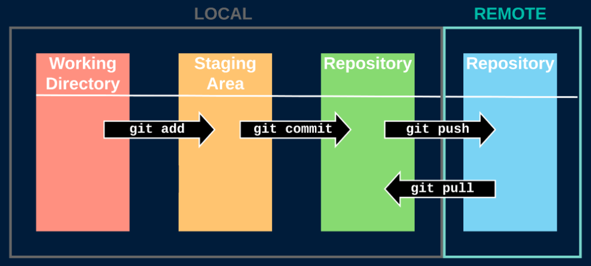

# GIT STAGES

> 📌 **Notas**

| #   | Stage               | Descripción                                                           |
|-----|---------------------|-----------------------------------------------------------------------|
| 1   | `Working Directory` | Carpeta de trabajo donde están los archivos sin rastrear (untracked). |
| 2   | `Staging Area`      | Espacio en memoria ram donde se guaradan los cambios (tracked).       |
| 3   | `Local Repository`  | Copia del repositorio de Git que reside en tu máquina local.          |                                             |
| 4   | `Remote Repository` | Versión centralizada del repositorio de Git.                          |                                             |



----

# Enviar archivos al siguiente stage

▶️ **Enviar archivos al staging area**
- Los archivos se envían desde el `working directory` hacia el `staging area`.
- Utilice `.` para todos los archivos modificados o especifique un archivo modificado. 
```shell script
git add .
git add <filename>
```

----

▶️ **Enviar archivos hacia el repositorio local**
- Los archivos se envían desde el `staging area` hacia el `local repository`.
- Utilice `-am` para realizar en un solo paso `add` y `commit` sobre los archivos anteriormente trackeados.
- Si no ingresa ningún argumento, entonces agregará manualmente el mensaje mediante el editor de texto VIM. 
  - Edite el mensaje de commit presionando `ESC` seguido de `i`
  - Guarde el commit presionando `ESC` seguido de `shift` + `z` + `z`
```shell script
git commit -m "<my-message>"
git commit -am "<my-message>"
git commit
```

----

▶️ **Enviar archivos al repositorio remoto**
<br>Los archivos se envían desde el `local repository` hacia el `remote repository`.
```shell script
git push -u origin <branch-name>
```

----

# Regresar archivos al stage anterior

▶️ **Regresar archivos al espacio de trabajo**
<br>Los archivos se regresan desde el `staging area` hacia el `working directory`.
```shell script
git rm --cached <filename>
```

----

# Operar sobre un repositorio remoto

▶️ **Clonar un repositorio remoto**
- Puede indicar el nombre de la carpeta que contendrá el repositorio.
- Utilice `-b` para especificar la rama que desea clonar.
```shell script
git clone <url-repository>
git clone <url-repository> <directory-name>
git clone -b <branch-name> <url-repository> <directory-name>
```

----

▶️ **Descargar los cambios del repositorio remoto**
- El `git pull` funciona como un `git fetch` en combinación con `git merge`.
- Utilice `origin` para especificar la rama de la que quiere obtener los cambios.
```shell script
git pull
git pull origin <branch-name>
```


